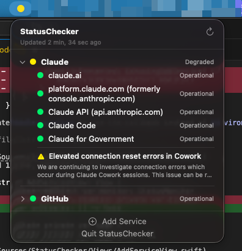

# StatusChecker



A lightweight macOS menubar utility that monitors service status pages at a glance. A colored dot in your menubar tells you instantly if any of your services have issues — green means all clear, yellow means degraded, red means outage.

Works with any service that uses [Atlassian Statuspage](https://www.atlassian.com/software/statuspage).

## Install

1. Download the latest `StatusChecker-vX.X.X.zip` from [Releases](https://github.com/rob-didio/status_checker/releases)
2. Extract and drag `StatusChecker.app` to your Applications folder
3. On first launch, right-click the app and select **Open** (required for unsigned apps)

Requires macOS 13 (Ventura) or later. Universal binary — runs natively on both Apple Silicon and Intel Macs.

## Usage

Click the colored dot in your menubar to see all monitored services. Each service shows a status summary that you can expand to see individual components and active incidents.

- **Green** — All systems operational
- **Yellow** — Degraded performance or active incident
- **Red** — Service outage

Right-click a service to open its status page in your browser or remove it.

### Adding services

Click **Add Service** at the bottom of the panel. You can quick-add from built-in presets:

| Service | Status Page |
|---|---|
| Claude | https://status.claude.com |
| GitHub | https://www.githubstatus.com |
| Datadog | https://status.datadoghq.com |
| Cloudflare | https://www.cloudflarestatus.com |
| OpenAI | https://status.openai.com |
| Vercel | https://www.vercel-status.com |
| Netlify | https://www.netlifystatus.com |
| Twilio | https://status.twilio.com |

You can also add any custom service that uses Atlassian Statuspage — enter a name and the status page URL (e.g. `https://status.example.com`), and the app will validate it before adding.

### Refresh

Services auto-refresh every 5 minutes and on wake from sleep. Click the refresh button in the panel header to update manually.

## Development

### Prerequisites

- macOS 13+
- Swift 5.9+ (included with Xcode 15+)

### Build and run

```bash
git clone https://github.com/rob-didio/status_checker.git
cd status_checker
swift build
swift run StatusChecker
```

### Project structure

```
Sources/StatusChecker/
  App/
    StatusCheckerApp.swift        # Entry point, MenuBarExtra scene
  Models/
    StatusPageModels.swift        # Codable types for Statuspage API
    MonitoredService.swift        # Service config + presets
  Services/
    StatusPageClient.swift        # async/await API client
    StatusMonitor.swift           # Central state, timer, refresh logic
    ServiceStore.swift            # UserDefaults persistence
  Views/
    MenuBarIcon.swift             # Colored circle for menubar
    StatusContentView.swift       # Main panel layout
    ServiceSectionView.swift      # Collapsible service section
    ComponentRowView.swift        # Single component row
    IncidentRowView.swift         # Active incident display
    AddServiceView.swift          # Add service dialog
```

### Adding a new preset service

Edit `PresetService.all` in `Sources/StatusChecker/Models/MonitoredService.swift`:

```swift
PresetService(name: "YourService", baseURL: URL(string: "https://status.yourservice.com")!)
```

The URL should be the root of an Atlassian Statuspage site (it must have a working `/api/v2/summary.json` endpoint).

### Creating a release

Tag and push to trigger the GitHub Actions release pipeline:

```bash
git tag v1.0.0
git push --tags
```

This builds a universal binary (arm64 + x86_64), wraps it in a `.app` bundle, and publishes a zip to GitHub Releases.

## License

MIT
